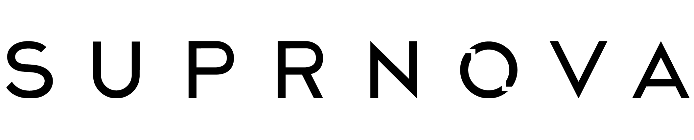

<!--# Suprnova Documentation -->

<!--  -->

Suprnova is a revolutionary new P2P (peer-to-peer) video encoding and delivery tool for content creators, powered by [Ara](https://ara.one/). It allows content creators to invite their fans to directly participate in the transcoding of new content. This is achieved by segmenting videos into tiny chunks of frames, which then get distributed to all participants in the Suprnova encoding pool to be processed. In exchange for this participation, users are rewarded by being the first to receive access to the new content.

!> **Coming to Windows 10 and Azure May 2019**

## Features

### Intel Hardware Acceleration {docsify-ignore}

<!--  --> 

In partnership with Intel, we are proud to offer Suprnova users a highly optimized encoding workflow, provided by Intel's Media SDK toolkit. It takes advantage of hardware instructions on your Intel i3, i5, i7, or i9 processor, which have been designed precisely for the purpose of accelerating transcodes. As a result, Suprnova pools encode video much more efficiently than other modern encoding workflows, and offer performance competitive with modern GPU pipelines - but at a fraction of
the cost!

### Peer-to-Peer Without Fear {docsify-ignore}

<!--  --> 

We've come a long way since the days of Napster. Suprnova is an entirely new approach to video transcoding, promoting the distribution and connectivity models introduced by BitTorrent. However, rather than contributing to the piracy problems that plague the media industry, Suprnova's use of P2P provides a brand new, legitimate and legal framework for participating in the encoding and distribution of your media. And unlike BitTorrent,
Suprnova users have a very strong incentive to share their resources with the rest of the pool, since this is what guarantees receipt of the content at the end of the process.

###  Littlstar RSS Feeds {docsify-ignore}

<!--  -->

When you are a member of a Suprnova Pool, you have access to the Pool's RSS feed, so that you can track and serve up content you helped encode right from a local webserver. Go to [my.littlstar.com](https://my.littlstar.com) to embed this RSS feed into your Littlstar app on Playstation 4. That way, your encoded content will always be waiting for you, accessible right from your couch and without *any* loading, buffering, or slow-downs!

### Double End-to-End Encryption {docsify-ignore}

<!--  --> 

Suprnova utilizes `noise-protocol`, [a sophisticated, modern, and open cryptography protocol](https://noiseprotocol.org/noise.html), to establish and persist Pool connections. Under the hood, we also leverage libsodium's `secretstream` and the `blake2b` encryption algorithm to lock down each socket connection made on the Pool. This combined approach makes Suprnova one of the safest video processing platforms on the market today.

### supr:// Protocol for UWP {docsify-ignore}

Suprnova GUI generates a simple web address for your Suprnova Pool, which Windows 10 users can click to immediately join and begin working on your content! No more sharing of secret keys and passwords over insecure connections like email. Simply click the `supr://` URL and start participating!

## Use Cases {docsify-ignore-all}

Suprnova's uses as a video encoder tool are numerous and broad, introducing entirely new possibilities for networked video processing and interaction. A few examples are detailed below.

### Sports Betting Pools

Suprnova was built to foster strong and committed communities, joined together by a common content interest. This allows ambitious media firms a whole new way to target and engage their fans, presenting exciting monetization opportunities, such as sports betting. Sports networks are facing the monumental challenge of migrating their broadcasting and delivery services to OTW, and fans have high quality and low latency expectations. Suprnova provides a safe, secure, and reliable peer-to-peer network through which fans can conduct legal gambling activities, making it easy to comply with all local and federal gambling regulations. The revenues generated from these activities deliver a higher margin per broadcast, while also reducing the streaming footprint!

### Premium Content Channels

If you have a paid/sponsored membership portal for your content, Suprnova is a great way to serve videos to your fans while keeping things "members only." The invite-only participation system means you'll be able to gate off any freeloaders, and the breakneck speeds at which Suprnova encodes video ensures that nobody will get their eyes on the content before your pool of trusted participants!

### Subscription Discounts

Suprnova joins together disparate customers and participants so that they can work together to accomplish difficult compute-heavy tasks as a team. In essence, this means very time-consuming, resource-heavy transcoding tasks can be offloaded from your own company's compute infrastructure, dramatically reducing cost of doing business in the digital media space. Passing these savings on to your customers could be an excellent way to reduce customer churn, promote more engaged viewing, and foster
a stronger, more resilient community around your content.

### Dailies

Dailies need to be viewed by many different people - some of whom are not expected to have a PC powerful enough to decode raw video camera captures. Using Suprnova, the video production crew can setup a Pool for the dailies shot each day, using all participants' systems to encode the video down to playable H.264. Thanks to Suprnova's distributed encoding workflow, no one pool participant's system will suffer slowdowns, so production can rest easy, knowing that hosting and participating
in this pool will result in no downtime or slowdowns in their other work.

### Time-Delayed VOD

As your viewers enjoy your broadcast or live stream, Suprnova can be used to simultaneously transcode segments of this content in real time, so that fans who missed the live event can immediately receive a high quality VOD encode of the stream. Now your message reaches your fans with much greater certainty and at a much higher quality to boot!
