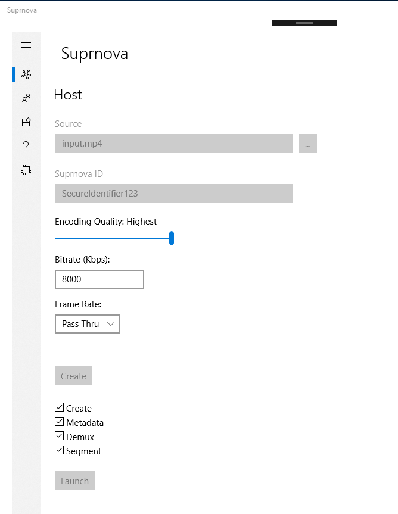
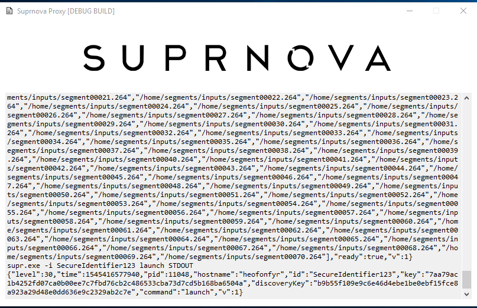
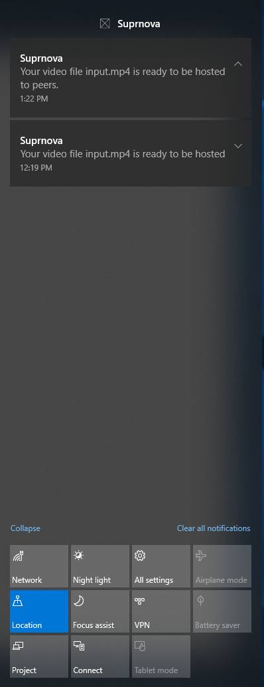

# Application UIs

## Host View

## Proxy Window

The proxy window is launched so that users can track progress of pool activities with debug-level insights.

## Toasts

When important updates occur, Suprnova presents a notification on your computer's toast bar.

